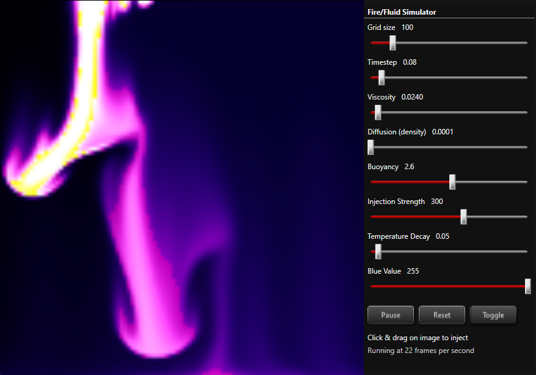

# FluidSim - WPF

## v1.0.0.0 - August, 2025
**Dependencies**

| Assembly | Version |
| ---- | ---- |
| .NET Framework | 4.0.30319 |

- A [WPF](https://learn.microsoft.com/en-us/dotnet/desktop/wpf) application that only uses the CPU to render a smoke/fire particle matrix.
- This can be adopted to simulate other fluids by adjusting the color and `Buoyancy`.
- To run in fullscreen mode pass the switch `-fullscreen` on launch.

